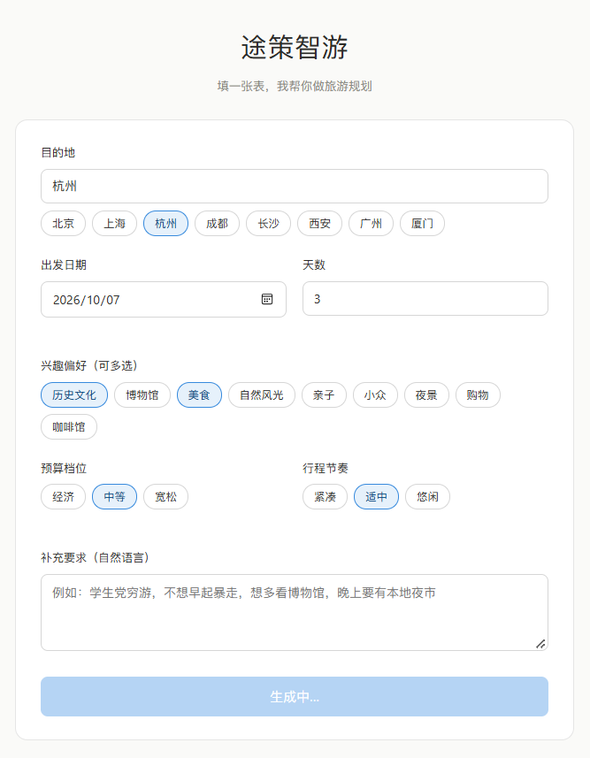
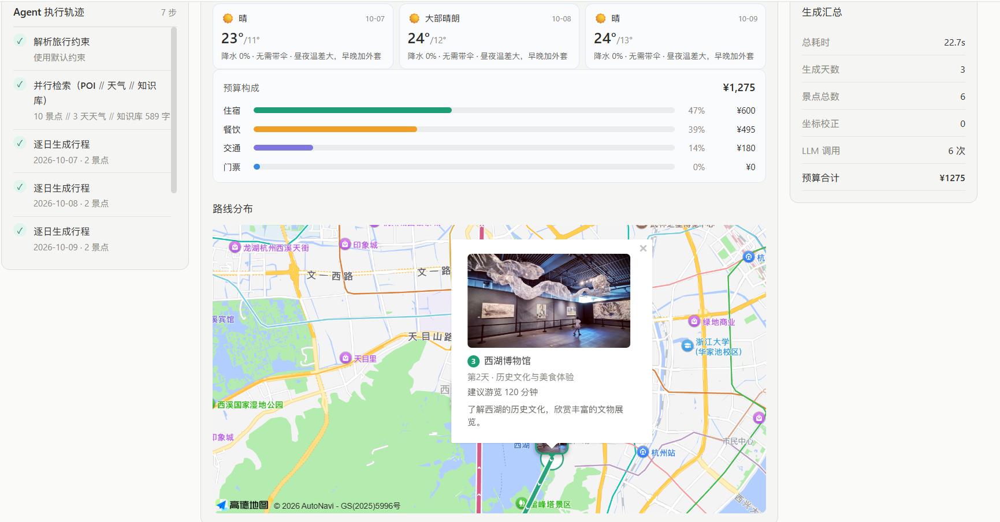
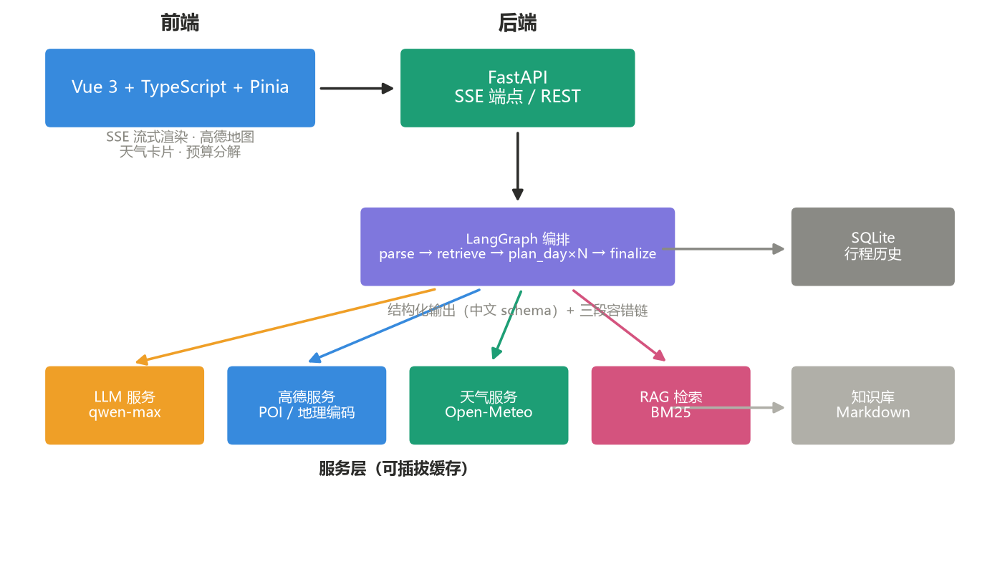
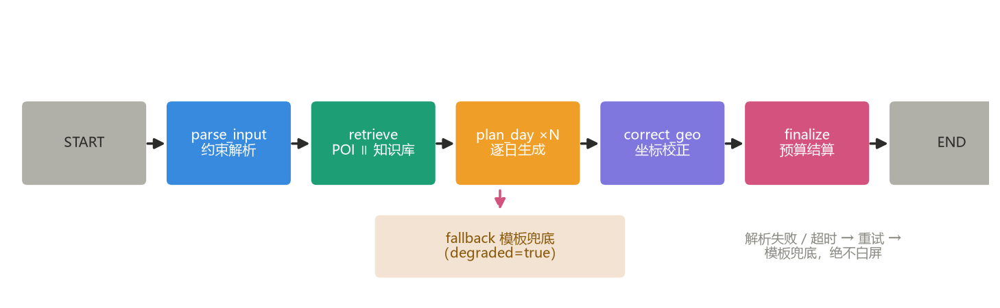
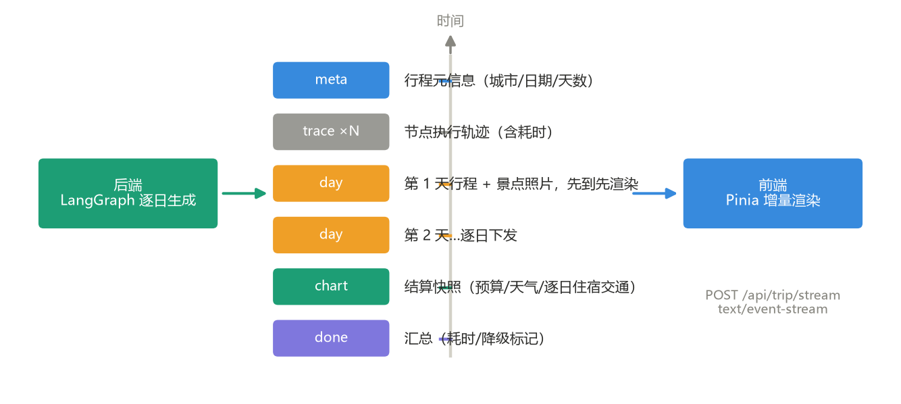
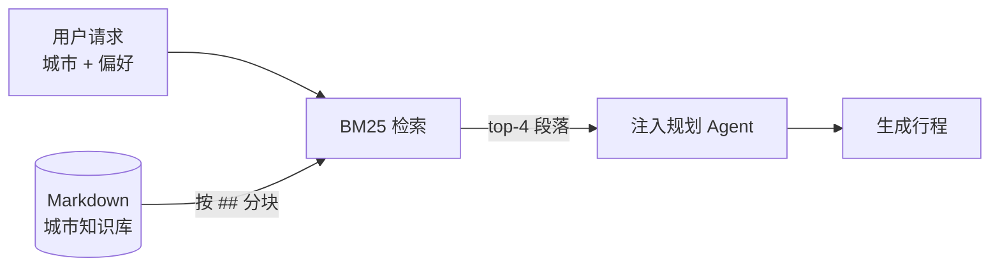

# 🗺️ 途策智游 · AI 行程规划

> **途**（路径）+ **策**（策略编排）+ **智**（智能）+ **游**（行程）
> 基于 **LangGraph 多阶段编排 + LangChain 结构化输出 + RAG 知识库 + SSE 流式渲染** 的全栈旅行规划应用

输入目的地与偏好，自动生成包含景点、三餐、住宿、交通、天气与预算的逐日行程。
**行程按天流式下发**，前端边接收边渲染，配合高德地图与数据卡片让预算、天气、路线随生成过程同步生长。

技术关键词：`LangGraph` `多阶段编排` `SSE 流式渲染` `RAG 知识库` `结构化输出`
`坐标校正` `可插拔缓存` `评测闭环` `高德地图 JS API` `Pinia`

---

## 📸 效果展示

> 运行项目后截图放入 `assets/showcase/`，取消下方注释即可展示。
> 建议截三张：规划首页（表单）、结果页（生成完成态）、行程历史页。

<!-- 截图后取消注释
### 规划首页



### 行程结果页（流式渲染完成态：逐日行程 + 高德路线 + 数据卡片）



### 行程历史


-->

---

## ✨ 项目亮点

- 🧠 **LangGraph 多阶段编排** — 约束解析 → 并行检索 → 逐日生成 ⟲ → 坐标校正 → 预算结算，条件边控制循环与分支，每完成一天立即流式下发
- ⚡ **SSE 流式体验** — 不等全部生成完，第 1 天行程完成即可见；trace 事件让 Agent 每步耗时前端可见
- 🎯 **结构化输出对齐中文模型** — schema 字段名用中文 alias 匹配 qwen-max 的语言习惯，解决"整份行程静默降级为模板"的隐性问题
- 🗺️ **真实坐标校正** — LLM 生成的经纬度基本是编造的；按「景点名 + 城市」回查高德 POI 用真实坐标覆盖，地图定位准确
- 📸 **真实景点照片** — 高德 POI 照片接口获取，地图标记即照片气泡，图文一致
- 📚 **RAG 城市知识库** — BM25 检索 Markdown 攻略（闭馆日 / 预约 / 避坑），新增城市零改代码
- 🌦️ **多源天气** — Open-Meteo 按景点坐标查询（比城市级更准），三级降级可切换
- 🗂️ **行程历史持久化** — SQLite 存储 + 内容哈希去重，支持保存 / 查看 / 删除
- 🧪 **评测闭环** — 8 项指标 + 用例集，量化行程质量，支持 RAG A/B 对比与 CI 门禁

### 与常见 LLM Demo 的差别

| 维度 | 常见做法 | 本项目 |
|---|---|---|
| 生成体验 | 一次请求等 5 分钟，期间白屏 | **SSE 逐日流式下发**，第 1 天完成即可见 |
| 编排方式 | 提示词硬约束或多轮串行调用 | **LangGraph 状态图**，条件边控制循环与分支 |
| 结构化输出 | 提示词里写"请只输出 JSON" | **`with_structured_output(Pydantic)`**，schema 级约束 |
| 检索 | 向量数据库自建 | **LangChain BM25Retriever**，知识库新增城市零改代码 |
| 坐标可信度 | 直接用 LLM 生成的经纬度 | **真实 POI 回查校正**，杜绝编造坐标 |
| 天气数据 | 单一数据源，城市级精度 | **按景点真实坐标查询**，多数据源可切换 |
| 可观测 | print 日志 | **trace 事件流**，前端可见每步耗时与降级状态 |
| 质量 | 人工目测 | **8 项评测指标 + 用例集**，支持 A/B 与 CI 阈值 |
| 持久化 | 无 | **行程历史落库 + 内容去重** |

---

## 🏗️ 技术架构

### 技术栈

| 层 | 技术 |
|---|---|
| 前端 | Vue 3 + TypeScript + Vite · Pinia · Vue Router · 高德地图 JS API（无重量级图表库，数据可视化组件均为自绘） |
| 后端 | FastAPI · LangGraph · LangChain · SQLAlchemy + SQLite · httpx |
| RAG | BM25Retriever + MarkdownHeaderTextSplitter + Markdown 知识库 |
| 外部服务 | 高德地图 Web 服务 API（POI / 地理编码）· 高德 JS API（路线底图）· Open-Meteo（天气，免费无需 Key） |
| 测试 | pytest + pytest-asyncio |

### 系统架构



### LangGraph 编排流程



- **parse_input**：把用户的自然语言自由描述解析为结构化约束（节奏 / 预算 / 兴趣点 / 忌口）
- **retrieve**：POI ∥ 知识库两路并行；天气在拿到景点坐标后按坐标查询（更精准）
- **plan_day**：按天生成，条件边根据剩余天数决定是否循环；**每完成一天立即 yield 出去**
- **correct_geo**：用候选池中的真实经纬度覆盖 LLM 输出，查不到则保留原值
- **finalize**：后端重算预算（不信任 LLM 给的总额），并把住宿 / 交通写回每一天
- **fallback**：任何阶段失败都转入模板兜底，标记 `degraded`，前端展示提示而非白屏

### SSE 事件流



| 事件 | 时机 | 前端行为 |
|---|---|---|
| `meta` | 立即 | 渲染页面骨架 |
| `trace` | 各阶段 | 累积到执行轨迹面板 |
| `day` | 每完成一天 | 追加一张行程卡片（含景点照片） |
| `patch` | 坐标校正后 | 定点更新坐标，不重发整天 |
| `chart` | 结算完成 | 携带完整逐日数据，覆盖刷新天卡片 |
| `done` | 收尾 | 展示耗时 / 降级状态 |
| `error` | 失败降级 | 顶部降级提示条 |

### RAG 检索流程



---

## 🧠 工程实践

在实现业务功能之外，重点解决了以下工程问题：

1. **三段式容错链** — LLM 超时 → 重试；结构化输出校验失败 → 携带错误信息回传模型自我纠正；仍失败 → 降级模板计划并标记 `degraded`。原则是**绝不把异常抛给用户**
2. **错误分级：可重试 vs 不可重试** — 超时/5xx/限流可重试；欠费、鉴权失败归为 `LLMUnavailableError` 立刻上抛，避免用户等几十秒只看到一句含糊的"生成失败"
3. **坐标校正** — LLM 生成的经纬度基本是编造的；按「景点名 + 城市」回查高德 POI 用真实坐标覆盖，查不到保留原值不阻断流程
4. **schema 字段名匹配模型语言习惯** — 实测 qwen-max 遇到英文 schema（`attractions`/`meals`）会按语义自造中文键（`{'景点': ...}`），导致**整份行程静默降级为模板**；解法是中文 `alias` + 提示词完整 JSON 示例 + `populate_by_name` + `extra="ignore"`
5. **容忍结构偏差** — 模型会把三餐数组输出成 `{"breakfast":..., "lunch":...}` 对象形态；用 `Union[List, Dict]` + 归一化统一处理，覆盖 5 种实测形态
6. **LangGraph reducer** — `days` 字段用自定义合并函数按 `day_index` 累积，否则第 N 天会覆盖前 N−1 天（逐日生成最容易踩的坑）
7. **SSE 按事件名分派** — `done` 事件含 `days_generated`（整数），用 `'days' in payload` 判断会误判；统一走 `parse_sse_frames()`
8. **结算数据两段拼合** — 流式 `day` 事件在结算前发出，天然没有住宿/交通；`chart` 事件在结算后携带完整逐日数据覆盖刷新，"先看到"与"补完整"两不误
9. **可插拔缓存** — 高德查询缓存抽象为 `BaseCache` 接口，换 Redis 只替换全局实例，业务代码零改动
10. **后端重算预算** — 不信任 LLM 给的总额，逐项由结构化数据累加并写回每一天，评测"预算一致"指标恒通过
11. **克制的技术选型** — 图表曾用 ECharts，重构时发现 4 个数字用 525 KB 图表库不划算：环形图改为纯 CSS 条形分解卡，依赖整个移除，构建产物减少约 540 KB，构建时间 7s → 3s

### 真实模型联调踩的坑（mock 模式发现不了）

| 问题 | 根因 | 解法 |
|---|---|---|
| 400 `'messages' must contain the word 'json'` | DashScope json_object 模式硬性要求 | `_ensure_json_hint()` 自动补「JSON」字样 |
| 行程全部降级为模板 | 中文模型不遵循英文 schema 字段名 | 字段加中文 `alias` + 提示词给完整示例 |
| 三餐解析失败 | 模型输出对象而非数组 | `Union[List, Dict]` + 归一化 |
| 显示「游览 2 分钟」 | 单位不明确，模型填了小时数 | schema 写明单位 + 后端 `_sane_duration()` 夹取 |

> 这些偏差都已固化为单元测试（`tests/test_drafts.py`），防止后续换模型时静默回归。

---

## 📁 项目结构

```
ai-trip-planner/
├── backend/
│   ├── app/
│   │   ├── agents/            # LangGraph 编排（graph 流程 / planner 节点实现）
│   │   ├── api/routes/        # trip（SSE/非流式）· poi · history 路由
│   │   ├── services/          # amap / llm / rag / weather 服务层
│   │   ├── core/              # config · cache（可插拔）· events（SSE 协议）
│   │   ├── models/            # schemas（数据契约）· drafts（LLM 结构化 schema）
│   │   ├── db/                # SQLAlchemy + SQLite 行程历史
│   │   └── api/main.py        # FastAPI 入口
│   ├── data/kb/               # RAG 城市旅行知识库（Markdown）
│   ├── eval/                  # 评测闭环（用例集 / 指标 / 运行器）
│   ├── tests/                 # pytest 单元测试
│   ├── requirements.txt
│   └── .env.example
├── frontend/
│   ├── src/
│   │   ├── views/             # Home（表单）/ Result（流式结果）/ History（历史）
│   │   ├── components/        # RouteMap（高德）· WeatherCards · BudgetBreakdown · TracePanel
│   │   ├── stores/            # Pinia：SSE 事件 → 响应式状态
│   │   ├── services/          # stream（SSE 客户端）· history（历史 API）
│   │   └── types/             # TypeScript 类型契约
│   └── package.json
├── assets/showcase/           # README 图片（架构图 / 运行截图）
└── README.md
```

---

## 🚀 快速开始

### 后端

```bash
cd backend
python -m venv .venv
.venv\Scripts\activate          # Windows
# macOS/Linux: source .venv/bin/activate

pip install -r requirements.txt

cp .env.example .env            # 填入 LLM_API_KEY 与 AMAP_API_KEY
uvicorn app.api.main:app --reload --port 8030
```

> **没有 API Key 也能跑**：未配置 Key 时自动进入 mock 模式，
> 用内置景点池 + 模板规划跑通完整链路，便于本地开发和 CI 自检。

### 前端

```bash
cd frontend
npm install
cp .env.example .env            # 填入 VITE_AMAP_WEB_KEY（路线图底图需要）
npm run dev
```

访问 `http://localhost:5273`。开发代理已将 `/api` 转发到 `http://localhost:8030`。

> **两个高德 Key 的区别**：`AMAP_API_KEY` 是**服务端** Web 服务类型（调 REST 接口）；
> `VITE_AMAP_WEB_KEY` 是**浏览器端**类型（加载 JS SDK）。
> 两者不能互换，用错会报 `10009 USERKEY_PLAT_NOMATCH`。

### ⚠️ Python 版本

**必须用 3.13 建虚拟环境**。项目依赖 pydantic-core 等含二进制扩展的包，
3.14 暂无预编译 wheel 会触发源码编译失败；`cpNNN` 二进制包也不能跨小版本复用。

启动前建议先 `conda deactivate`，避免 conda base 与 venv 双重激活
（提示符同时出现 `(.venv) (base)` 时，会加载到错误的包）。

---

## 🔑 环境变量

| 变量 | 说明 | 缺省行为 |
|---|---|---|
| `LLM_API_KEY` | OpenAI 兼容接口 Key（通义/DeepSeek/OpenAI 均可） | 走模板兜底 |
| `LLM_BASE_URL` | 接口地址 | `https://api.openai.com/v1` |
| `LLM_MODEL_ID` | 模型名 | `gpt-4o-mini` |
| `AMAP_API_KEY` | 高德 Web 服务 Key（POI + 地理编码，服务端用） | 使用内置 mock 景点池 |
| `VITE_AMAP_WEB_KEY` | 高德 JS API Key（浏览器端路线图用） | 路线图提示未配置，不影响其他功能 |
| `WEATHER_PROVIDER` | 天气数据源：`open-meteo` / `amap` | `open-meteo` |
| `RAG_ENABLED` | 置 `0` 关闭知识库注入（做 A/B 对比） | `1` |
| `MOCK_MODE` | 置 `1` 强制 mock | 自动（无 LLM Key 时） |

### 为什么天气用 Open-Meteo 而不是高德

实测高德天气接口返回 `10002 SERVICE_NOT_AVAILABLE`，
用两个独立 Key 验证均如此（POI 搜索与地理编码正常），确认是账号级配额限制。

Open-Meteo 的优势不只是免费：它支持**按经纬度查询**，
而高德只接受城市 adcode。本项目已有每个景点的真实坐标，
因此拿到的天气是景点级的，比城市级更精准。

天气服务设计为多数据源，三级降级：
`open-meteo（按坐标）→ 高德（按城市名）→ mock`。
若账号开通高德天气权限，只需把 `WEATHER_PROVIDER` 改成 `amap`，代码零改动。

---

## 📚 RAG 知识库

新增城市只需放一个 Markdown 文件到 `backend/data/kb/`：

```
{城市}旅行知识库.md
```

按 `##` 二级标题分节（城市概况 / 行前准备 / 景点知识 / 美食 / 住宿 / 避坑）。
**新增城市无需改任何代码**，首次检索时自动加载索引。
当前覆盖：北京、杭州。重点写"本地经验"（闭馆日、预约要求、避坑），
而不是景点简介——这样注入提示词才真正提升行程质量。

---

## 📡 主要接口

启动后访问 `http://localhost:8030/docs`（Swagger）。

| 方法 | 路径 | 说明 |
|---|---|---|
| POST | `/api/trip/stream` | **SSE 流式生成行程**（核心接口） |
| POST | `/api/trip/plan` | 非流式生成（供脚本 / 评测） |
| GET | `/api/trip/knowledge/cities` | 已覆盖知识库的城市 |
| GET | `/api/trip/health` | 健康检查与依赖状态 |
| GET | `/api/poi/search` | POI 搜索 |
| GET | `/api/map/weather` | 天气查询 |
| GET | `/api/map/geocode` | 地理编码（坐标校验工具） |
| POST | `/api/trips` | 保存行程到历史（内容去重） |
| GET | `/api/trips` | 行程历史列表 |
| GET | `/api/trips/{id}` | 行程详情 |
| DELETE | `/api/trips/{id}` | 删除行程 |

### 持久化设计

行程以 JSON 整份存储而非拆关系表 —— 行程结构本身是嵌套且会持续演进的
（新增字段时拆表需要写迁移）。用 `plan_hash`（内容排序后 MD5）做去重，
重复保存同一份行程不会产生新记录。

存储分工：**数据库存「用户要留下来的行程」，缓存存「短期内可复用的外部查询结果」**。

---

## 🧪 测试与评测

```bash
cd backend
pytest                                    # 单元测试，无网络依赖

python -m eval.run_eval --mode mock        # 免 Key 自检：跑通评测管线
python -m eval.run_eval --mode real        # 真实调用，输出质量报告
python -m eval.run_eval --mode real --limit 3 --no-rag   # A/B：关闭知识库对比
python -m eval.run_eval --mode real --json report.json   # 导出报告
```

### 评测指标

硬指标（不满足即质量问题）：天数匹配 · 景点数量 · 三餐完整 · 预算一致 · 坐标有效 · 无编造景点 · 无空字段 · 非降级行程

软指标（单独记录为警告）：天气覆盖

指标是**独立纯函数**，不针对单条用例写死断言，因此可以整体评估任意输入，也可作为 CI 门禁
（`--threshold` 控制退出码）。

### 验证结果

```
pytest                                → 112 passed
python -m eval.run_eval --mode mock   → 7 用例，平均 0.875
python -m eval.run_eval --mode real   → 用例全通过，指标全绿，无警告
```

真实模式实测：2 天行程约 20s 完成，LLM 调用 3 次，`degraded=False`，
产出南宋德寿宫遗址博物馆、杭州博物馆等真实景点，三餐为知味观/外婆家/楼外楼（非模板默认值），
天气为 Open-Meteo 真实数据（按景点坐标查询，含降水概率）。
