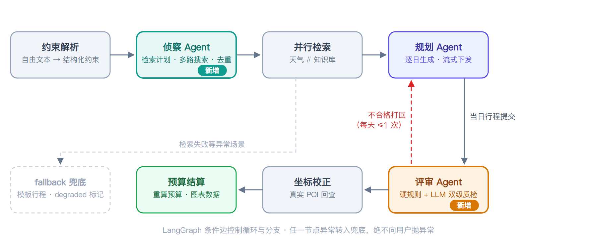
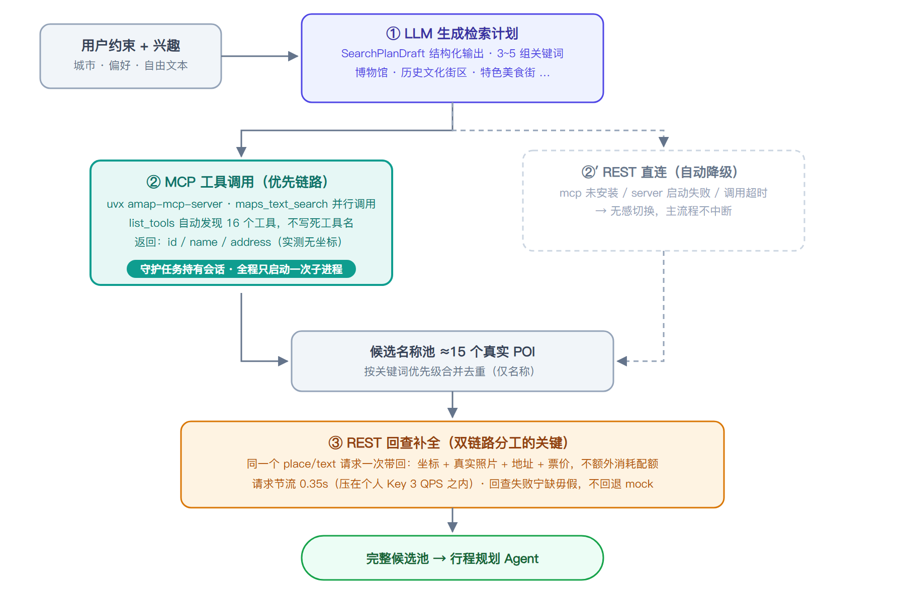
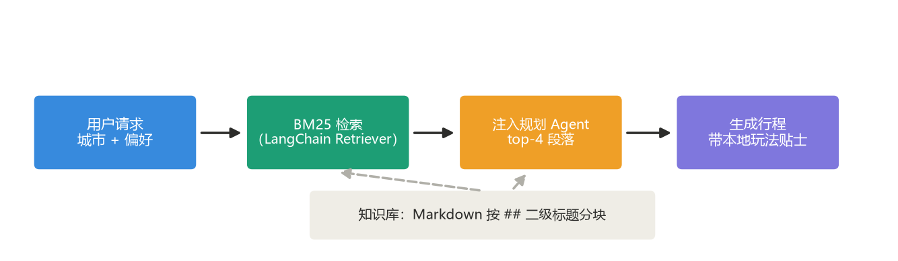

# 🗺️ 途策智游

> **途**（路径）+ **策**（策略编排）+ **智**（智能）+ **游**（行程）
> 基于 **LangGraph 多智能体编排 + MCP 工具调用 + LangChain 结构化输出 + RAG 知识库 + SSE 流式渲染** 的全栈旅行规划应用

输入目的地与偏好，自动生成包含景点、三餐、住宿、交通、天气与预算的逐日行程。
**行程按天流式下发**，前端边接收边渲染，配合高德地图与数据卡片让预算、天气、路线随生成过程同步生长。

---

## 📸 效果展示

### 规划首页


### 行程结果页（数据卡片 + 高德路线 + 点击标记查看景点详情）


### 逐日行程（景点照片 · 三餐 · 住宿交通明细 · 每日花费）


### 行程历史（SQLite 持久化 + 内容去重）


---

## ✨ 项目亮点

- 🤖 **多智能体协作（LangGraph 状态图）** — 约束 Agent → **侦察 Agent**（生成检索计划）→ 规划 Agent（逐日生成）⟲ → **评审 Agent**（质检打回）⟲ → 坐标校正 → 预算结算，条件边控制循环与分支，每完成一天立即流式下发
- 🔌 **MCP 工具调用 + REST 双链路** — 自研框架无关的 MCP 客户端接入高德 MCP 服务，**持久会话复用**（对比常见"每次调用 spawn 子进程"的实现），MCP 不可用时自动降级 REST 直连，主流程永不中断
- ⚡ **SSE 流式体验** — 不等全部生成完，第 1 天行程完成即可见；trace 事件携带每个 Agent 的**真实耗时**（duration_ms），前端天然是一份执行性能剖面
- 🎯 **结构化输出对齐中文模型** — schema 字段名用中文 alias 匹配 qwen-max 的语言习惯，解决"整份行程静默降级为模板"的隐性问题
- 🗺️ **真实坐标校正** — LLM 生成的经纬度基本是编造的；按「景点名 + 城市」回查高德 POI 用真实坐标覆盖，地图定位准确
- 📚 **RAG 城市知识库** — BM25 检索 Markdown 攻略（闭馆日 / 预约 / 避坑），新增城市零改代码
- 🌦️ **多源天气** — Open-Meteo 按景点坐标查询（比城市级更准），三级降级可切换
- 🗂️ **行程历史持久化** — SQLite 存储 + 内容哈希去重，支持保存 / 查看 / 删除
- 🧪 **评测闭环** — 8 项指标 + 用例集，量化行程质量，支持 RAG A/B 对比与 CI 门禁
- 🐳 **一键部署** — Docker Compose 编排前后端，nginx 反代保 SSE 流式，数据卷持久化

### 与常见 LLM Demo 的差别

| 维度 | 常见做法 | 本项目 |
|---|---|---|
| 生成体验 | 一次请求等 5 分钟，期间白屏 | **SSE 逐日流式下发**，第 1 天完成即可见 |
| 编排方式 | 提示词硬约束或多轮串行调用 | **多智能体状态图**：侦察 / 规划 / 评审各司其职，评审打回形成质量闭环 |
| 工具调用 | REST 直连写死 | **MCP 协议接入**（工具自动发现），持久会话 + REST 自动降级 |
| 候选检索 | 单关键词搜一次 | **Agent 生成多关键词检索计划**，多路并行 + 去重合并 |
| 质量保障 | 人工目测 | **评审 Agent 硬规则 + LLM 双级质检**（编造景点检测 / 超时 / 避开项），打回重做有重试上限 |

---

## 🏗️ 技术架构

### 技术栈

| 层 | 技术 |
|---|---|
| 前端 | Vue 3 + TypeScript + Vite · Pinia · Vue Router |
| 后端 | FastAPI · LangGraph 多智能体编排 · LangChain · SQLAlchemy + SQLite · httpx |
| MCP | 自研 MCP 客户端（stdio 持久会话）· amap-mcp-server（高德 MCP 服务） |
| RAG | BM25Retriever + MarkdownHeaderTextSplitter + Markdown 知识库 |
| 外部服务 | 高德地图 Web 服务 API（POI / 地理编码，REST 降级链路）· 高德 JS API（路线底图）· Open-Meteo（天气，免费无需 Key） |
| 测试 | pytest + pytest-asyncio |

### 系统架构


### 多智能体编排流程（LangGraph）



- **parse_input（约束 Agent）**：把用户的自然语言自由描述解析为结构化约束（节奏 / 预算 / 兴趣点 / 忌口）
- **scout_poi（侦察 Agent）**：LLM 生成多关键词检索计划（`SearchPlanDraft`）→ 每组关键词经 **MCP 工具**（优先）或 REST 直连（降级）并行搜索 → 按名称合并去重出候选池
- **retrieve**：天气 ∥ 知识库两路并行；天气在拿到候选坐标后按坐标查询（更精准）
- **plan_day（规划 Agent）**：按天生成，每完成一天立即流式下发；评审打回时修改意见注入提示词重做
- **review_day（评审 Agent）**：单日质检——硬规则（编造景点检测 / 超 8 小时 / 缺餐次 / 违反避开项）+ LLM 体验评审；不合格打回 `plan_day`，每天最多打回 1 次，防死循环
- **correct_geo**：用候选池中的真实经纬度覆盖 LLM 输出，查不到则保留原值
- **finalize**：后端重算预算（不信任 LLM 给的总额），并把住宿 / 交通写回每一天
- **fallback**：候选检索失败等场景转入模板兜底，标记 `degraded`，前端展示提示而非白屏

**MCP 双链路设计**：



| 环节 | 行为 |
|---|---|
| 会话管理 | **专职守护任务**持有会话：MCP 子进程全程只启动一次，进入/退出 anyio 上下文永远在同一个 asyncio Task 内（满足 mcp SDK 的 same-task 约束）；异常自动重建，应用退出统一清理 |
| 工具发现 | `list_tools()` 自动发现并缓存，不写死工具名（`MCP_POI_TOOL` 可配） |
| 降级策略 | mcp 包未安装 / server 启动失败 / 调用超时 → 自动切 REST 直连 → 仍失败用 mock 池 |
| 结果解析 | 兼容原始高德结构与已归一化结构两种返回形态，解析失败不抛异常 |

### MCP 实测记录

| 验证项 | 实测结果 |
|---|---|
| 工具发现 | `list_tools()` 自动发现 amap-mcp-server 的 **16 个工具**（含 maps_text_search / maps_weather 等） |
| 检索计划 | LLM 依据兴趣生成 5 组关键词：`博物馆 / 历史文化街区 / 特色美食街 / 历史古迹 / 安静的公园` |
| 检索链路 | trace 显示 `链路 mcp`，15 个候选全部来自 MCP 工具调用（真实 POI：南宋德寿宫遗址博物馆、杭州博物馆等） |
| 坐标补全 | **15/15** 全部命中（多轮实测共 75 次回查零失败；串行 + 0.35s 节流把节奏压在高德个人 Key 的 3 QPS 阈值内） |

联调发现的四个真问题与修复（均已固化为代码与测试）：

1. **参数类型坑**：amap-mcp-server 的 `citylimit` 要求字符串，传 bool 被 server 端 pydantic 直接拒绝 → 调用参数改为 `"true"`
2. **坐标与照片缺失**：该 server 的搜索工具只返回 id/name/address（`show_fields` 被忽略）→ 引入「MCP 发现 + REST 回查补全」双链路分工；且回查一次请求同时带回坐标、**真实照片**、地址、票价（最初只回传坐标，导致整趟行程地图气泡全部无图——MCP 候选没有照片字段，REST 回查是补照片的唯一入口）
3. **QPS 限流**：最初 15 路并发补全触发 `CUQPS_HAS_EXCEEDED_THE_LIMIT`，且失败静默回退 mock 池导致多个景点坐标被污染成同一点 → 信号量串行化（`Semaphore(1)`）+ **请求节流 0.35s**（把节奏压在个人 Key 3 QPS 阈值以内，从"被拒再重试"变成"根本不触发"）+ 退避重试兜底，坐标回查一律 `fallback_mock=False`（宁缺毋假）
4. **MCP 依赖解析冲突（静默失效）**：uvx 为 amap-mcp-server 解析出 `mcp 1.8.x + pydantic 2.14`，而前者仍引用 `pydantic._internal._typing_extra.eval_type_backport`（该符号自 pydantic 2.12 起已移除）→ server 启动即 `ImportError`，链路**静默降级 REST**：不报错、功能可用，但 MCP 实际从未生效 → 启动命令固定 `--with pydantic<2.12`，trace 的「链路」字段可直接暴露该状态

> 实测数据来自真实链路（非 mock）。复现：装好 `mcp` 包，在根目录 `.env` 配好 `AMAP_API_KEY` 与 `LLM_API_KEY`，生成一次行程即可在 trace 中看到同等数据（联调脚本未入库）。容器环境默认 `MCP_ENABLED=0`，POI 检索自动沿降级链走 REST

### SSE 事件流


| 事件 | 时机 | 前端行为 |
|---|---|---|
| `meta` | 立即 | 渲染页面骨架 |
| `trace` | 各阶段 | 累积到执行轨迹面板 |
| `day` | 每完成一天 | 追加一张行程卡片（含景点照片） |
| `patch` | 坐标校正后 | 定点更新坐标，不重发整天 |
| `chart` | 结算完成 | 携带完整逐日数据，覆盖刷新天卡片 |
| `done` | 收尾 | 展示耗时 / 降级状态 |
| `error` | 失败降级 | 顶部降级提示条 |

### RAG 检索流程



- 中文按二元组分词（"故宫博物院" → 故宫 / 宫博 / 博物 / 物院），解决查询词与文档片段的匹配问题
- 城市无知识库时静默降级，不影响主流程
- 当前覆盖：北京、杭州

---

## 🧠 工程实践

在实现业务功能之外，重点解决了以下工程问题：

1. **MCP 持久会话（守护任务模式）** — 常见 MCP 集成每次工具调用都 spawn 子进程再销毁，一次行程开关进程十几次；本项目子进程全程只启动一次，异常自动重建，FastAPI lifespan 退出时统一清理。联调时踩到了 mcp SDK 的深层约束：`stdio_client` 的 anyio cancel scope **必须在进入它的同一个 asyncio Task 中退出**，跨任务关闭会抛 `Attempted to exit cancel scope in a different task` 并导致连接报废。最终方案是「专职守护任务」——由唯一后台任务负责连接的建立与销毁，业务任务通过事件握手使用会话，彻底规避该错误
2. **多 Agent 质量闭环** — 评审 Agent 对每天行程做「硬规则 + LLM」双级质检：编造景点名检测（名称必须来自候选池）、超 8 小时、缺餐次、违反避开项；不合格打回规划 Agent 重做，修改意见注入提示词，每天重试上限 1 次防死循环；前端按 `day_index` upsert，打回重做的修正版原地替换、无重复卡片
3. **检索计划 Agent 化** — 候选景点检索从「单关键词搜一次」升级为侦察 Agent 生成 3-5 组关键词（覆盖用户全部兴趣维度）并行检索、按优先级去重合并；无 LLM 时退化为确定性计划，mock 评测可跑
4. **三段式容错链** — LLM 超时 → 重试；结构化输出校验失败 → 携带错误信息回传模型自我纠正；仍失败 → 降级模板计划并标记 `degraded`。原则是**绝不把异常抛给用户**
5. **错误分级：可重试 vs 不可重试** — 超时/5xx/限流可重试；欠费、鉴权失败归为 `LLMUnavailableError` 立刻上抛，避免用户等几十秒只看到一句含糊的"生成失败"
6. **坐标校正** — LLM 生成的经纬度基本是编造的；按「景点名 + 城市」回查高德 POI 用真实坐标覆盖，查不到保留原值不阻断流程
7. **schema 字段名匹配模型语言习惯** — 实测 qwen-max 遇到英文 schema（`attractions`/`meals`）会按语义自造中文键（`{'景点': ...}`），导致**整份行程静默降级为模板**；解法是中文 `alias` + 提示词完整 JSON 示例 + `populate_by_name` + `extra="ignore"`
8. **容忍结构偏差** — 模型会把三餐数组输出成 `{"breakfast":..., "lunch":...}` 对象形态；用 `Union[List, Dict]` + 归一化统一处理，覆盖 5 种实测形态
9. **LangGraph reducer** — `days` 字段用自定义合并函数按 `day_index` 累积，否则第 N 天会覆盖前 N−1 天（逐日生成最容易踩的坑）
10. **SSE 按事件名分派** — `done` 事件含 `days_generated`（整数），用 `'days' in payload` 判断会误判；统一走 `parse_sse_frames()`
11. **结算数据两段拼合** — 流式 `day` 事件在结算前发出，天然没有住宿/交通；`chart` 事件在结算后携带完整逐日数据覆盖刷新，"先看到"与"补完整"两不误
12. **可插拔缓存** — 高德查询缓存抽象为 `BaseCache` 接口，换 Redis 只替换全局实例，业务代码零改动
13. **后端重算预算** — 不信任 LLM 给的总额，逐项由结构化数据累加并写回每一天，评测"预算一致"指标恒通过
14. **克制的技术选型** — 图表曾用 ECharts，重构时发现 4 个数字用 525 KB 图表库不划算：环形图改为纯 CSS 条形分解卡，依赖整个移除，构建产物减少约 540 KB，构建时间 7s → 3s

### 真实模型联调踩的坑（mock 模式发现不了）

| 问题 | 根因 | 解法 |
|---|---|---|
| 400 `'messages' must contain the word 'json'` | DashScope json_object 模式硬性要求 | `_ensure_json_hint()` 自动补「JSON」字样 |
| 行程全部降级为模板 | 中文模型不遵循英文 schema 字段名 | 字段加中文 `alias` + 提示词给完整示例 |
| 三餐解析失败 | 模型输出对象而非数组 | `Union[List, Dict]` + 归一化 |
| 显示「游览 2 分钟」 | 单位不明确，模型填了小时数 | schema 写明单位 + 后端 `_sane_duration()` 夹取 |
| 每天吃一模一样的饭 | LLM 看不到前几天的产出，逐日生成时每天复制同一份菜单（实测北京 2 天都是护国寺小吃 + 烤鸭 + 炸酱面） | 前几日餐食注入提示词并禁止重复 + 评审 Agent 新增「跨天重复」硬规则（≥2 餐雷同打回） |

> 这些偏差都已固化为单元测试（`tests/test_drafts.py`），防止后续换模型时静默回归。

---

## 📁 项目结构

```
ai-trip-planner/
├── backend/
│   ├── app/
│   │   ├── agents/            # 多智能体编排（graph 流程 / planner：侦察·规划·评审节点实现）
│   │   ├── api/routes/        # trip（SSE/非流式）· poi · history 路由
│   │   ├── services/          # amap / llm / rag / weather 服务层
│   │   ├── tools/             # mcp_client（自研 MCP 客户端，持久会话 + 降级）
│   │   ├── core/              # config · cache（可插拔）· events（SSE 协议）
│   │   ├── models/            # schemas（数据契约）· drafts（LLM 结构化 schema）
│   │   ├── db/                # SQLAlchemy + SQLite 行程历史
│   │   └── api/main.py        # FastAPI 入口（lifespan 清理 MCP 会话）
│   ├── data/kb/               # RAG 城市旅行知识库（Markdown）
│   ├── eval/                  # 评测闭环（用例集 / 指标 / 运行器）
│   ├── tests/                 # pytest 单元测试
│   ├── Dockerfile             # python:3.13-slim，非 root 运行
│   └── requirements.txt
├── frontend/
│   ├── src/
│   │   ├── views/             # Home（表单）/ Result（流式结果）/ History（历史）
│   │   ├── components/        # RouteMap（高德）· WeatherCards · BudgetBreakdown · TracePanel
│   │   ├── stores/            # Pinia：SSE 事件 → 响应式状态
│   │   ├── services/          # stream（SSE 客户端）· history（历史 API）
│   │   └── types/             # TypeScript 类型契约
│   ├── Dockerfile             # 多阶段：node 构建 → nginx 托管
│   ├── nginx.conf             # 静态托管 + /api 反代（关 proxy_buffering 保 SSE）
│   └── package.json
├── docker-compose.yml         # 前后端编排（healthcheck 依赖 + 数据卷）
├── .env.example               # 唯一配置模板（后端 / 前端 / compose 共用）
├── .github/workflows/ci.yml   # CI：后端 pytest + 前端构建
├── assets/showcase/           # README 图片（架构图 / 运行截图）
└── README.md
```

---

## 🚀 快速开始

### 配置（三种启动方式共用一份）

```bash
cp .env.example .env            # 在项目根目录执行，填入自己的 Key
```

`.env` 只放**项目根目录一份**，三处共用：后端（`config.py` 显式加载）、
前端（`vite.config.ts` 的 `envDir` 指向根目录）、docker compose（`env_file` + build args）。

> 为了做到这一点，前端设置了 `envDir`、后端按路径查找 `.env`——
> vite 和 python-dotenv 的默认行为都不满足「单一配置源」：vite 只读 frontend/ 下的，
> 而 build arg 更是只能从根目录读。集中一份能避免"改了 A 忘了 B"的配置漂移。

### 后端

```bash
cd backend
python -m venv .venv
.venv\Scripts\activate          # Windows
# macOS/Linux: source .venv/bin/activate

pip install -r requirements.txt

uvicorn app.api.main:app --reload --port 8030
```

> **没有 API Key 也能跑**：未配置 Key 时自动进入 mock 模式，
> 用内置景点池 + 模板规划跑通完整链路，便于本地开发和 CI 自检。
> 此时前端页面的地图区域会提示未配置 Key，不影响其他功能。

### 🐳 Docker 一键启动

不想配环境的话，用 Docker Compose 把前后端一起拉起来：

```bash
cp .env.example .env            # 同上，根目录一份配置
docker compose up --build
```

访问 `http://localhost:5273` 即前端；后端 Swagger 调试接口在 `http://localhost:8030/docs`。

> **为什么 `VITE_AMAP_WEB_KEY` 必须写在根目录 `.env`**：compose 的 build args
> 只能从项目根目录的 `.env` 插值，它不会读子目录里的 env 文件。
> 而 `VITE_` 变量是 vite **构建时**内联进产物的，运行时再注入无效——
> 所以这个 Key 必须在构建阶段就传进去，否则页面提示「地图加载失败」。

**国内构建加速**（写在根目录 `.env` 里即可，或临时用环境变量覆盖）：

```bash
# .env 中已含以下两行，不需要额外操作；命令行覆盖示例：
PIP_INDEX_URL=https://mirrors.cloud.tencent.com/pypi/simple \
NPM_REGISTRY=https://registry.npmmirror.com \
docker compose up --build
```

Docker Hub 拉不动基础镜像时，在 Docker Desktop → Settings → Docker Engine
的 `registry-mirrors` 里加国内加速器即可（`Dockerfile` 里写的仍是官方镜像名，
加速器只作用于本机，不影响他人 clone 后构建）。

容器化时的几个设计决策：

| 决策 | 原因 |
|---|---|
| 前端多阶段构建（node 构建 → nginx 托管） | 最终镜像只含静态文件，不含 node_modules 和源码 |
| nginx 反代 `/api` 并**关闭缓冲** | SSE 流式必须关 `proxy_buffering`，否则事件被攒成一次性返回——和 vite dev 代理是同一个坑 |
| 容器内默认 `MCP_ENABLED=0` | 容器里没有 uvx，起不了 MCP server；POI 检索沿三级降级链自动落到 REST 直连 |
| 数据库单独放 `dbdata/`，卷只挂这个目录 | 若把卷挂在 `data/` 上会**遮蔽镜像内的 RAG 知识库**，更新语料后重建镜像不生效；分开挂则静态资源随镜像走、运行时数据随卷走 |
| 镜像内预建 `dbdata/` 并 `chown` 给非 root 用户 | 新数据卷首次挂载会继承镜像目录的属主；否则 root 属主的卷会让非 root 进程写不进 SQLite |
| 前端高德 Key 走 build arg | `VITE_` 前缀变量是 vite **构建时**内联的，运行时传环境变量无效 |
| pip / npm 源做成 build arg | 国内构建可控加速，同时仓库默认仍用官方源，保持通用 |

**实测记录**（Windows + Docker Desktop，WSL2 后端）：

- 镜像构建：前后端合计约 1 分钟（走国内源）
- 健康检查：`/api/trip/health` 返回 `mock_mode: false`，两个 Key 正确注入容器
- SSE 流式：经 nginx 反代请求真实行程，10 个事件在 13 秒内**逐条到达**
  （trace → day → chart → done），确认反代未缓冲
- 数据持久化：保存行程后 `docker compose down && up` 重建容器，历史记录仍在

### 前端

```bash
cd frontend
npm install
npm run dev                     # env 变量已在根目录 .env 配好，无需再复制
```

访问 `http://localhost:5273`。开发代理已将 `/api` 转发到 `http://localhost:8030`。

> **两个高德 Key 的区别**：`AMAP_API_KEY` 是**服务端** Web 服务类型（调 REST 接口）；
> `VITE_AMAP_WEB_KEY` 是**浏览器端**类型（加载 JS SDK）。
> 两者不能互换，用错会报 `10009 USERKEY_PLAT_NOMATCH`。

### ⚠️ Python 版本

**必须用 3.13 建虚拟环境**。项目依赖 pydantic-core 等含二进制扩展的包，
3.14 暂无预编译 wheel 会触发源码编译失败；`cpNNN` 二进制包也不能跨小版本复用。

启动前建议先 `conda deactivate`，避免 conda base 与 venv 双重激活
（提示符同时出现 `(.venv) (base)` 时，会加载到错误的包）。

---

## 🔑 环境变量

全部变量集中写在**项目根目录的 `.env`**（模板见 `.env.example`），后端 / 前端 / compose 共用一份。

| 变量 | 说明 | 缺省行为 |
|---|---|---|
| `LLM_API_KEY` | OpenAI 兼容接口 Key（通义/DeepSeek/OpenAI 均可） | 走模板兜底 |
| `LLM_BASE_URL` | 接口地址 | `https://api.openai.com/v1` |
| `LLM_MODEL_ID` | 模型名 | `gpt-4o-mini` |
| `AMAP_API_KEY` | 高德 Web 服务 Key（POI + 地理编码，服务端用；同时透传给 MCP server） | 使用内置 mock 景点池 |
| `VITE_AMAP_WEB_KEY` | 高德 JS API Key（浏览器端路线图用） | 路线图提示未配置，不影响其他功能 |
| `MCP_ENABLED` | 置 `0` 关闭 MCP 链路（POI 检索直接走 REST） | `1` |
| `MCP_SERVER_COMMAND` | MCP server 启动命令（JSON 数组字符串） | `["uvx", "amap-mcp-server"]` |
| `MCP_POI_TOOL` | 用于 POI 检索的 MCP 工具名 | `maps_text_search` |
| `MCP_TIMEOUT` | MCP 单次调用超时（秒） | `30` |
| `WEATHER_PROVIDER` | 天气数据源：`open-meteo` / `amap` | `open-meteo` |
| `RAG_ENABLED` | 置 `0` 关闭知识库注入（做 A/B 对比） | `1` |
| `MOCK_MODE` | 置 `1` 强制 mock | 自动（无 LLM Key 时） |
| `DB_PATH` | SQLite 文件路径（容器内指到挂载卷） | `backend/trip_planner.db` |
| `PIP_INDEX_URL` / `NPM_REGISTRY` | 构建镜像时的依赖源（仅 Docker 构建阶段生效） | 官方源 |

> MCP 依赖：`pip install mcp`（已列入 requirements.txt）。未安装或 server 不可用时自动降级 REST，不影响使用。

### 为什么天气用 Open-Meteo 而不是高德

实测高德天气接口返回 `10002 SERVICE_NOT_AVAILABLE`，
用两个独立 Key 验证均如此（POI 搜索与地理编码正常），确认是账号级配额限制。

Open-Meteo 的优势不只是免费：它支持**按经纬度查询**，
而高德只接受城市 adcode。本项目已有每个景点的真实坐标，
因此拿到的天气是景点级的，比城市级更精准。

天气服务设计为多数据源，三级降级：
`open-meteo（按坐标）→ 高德（按城市名）→ mock`。
若账号开通高德天气权限，只需把 `WEATHER_PROVIDER` 改成 `amap`，代码零改动。

---

## 📚 RAG 知识库

新增城市只需放一个 Markdown 文件到 `backend/data/kb/`：

```
{城市}旅行知识库.md
```

按 `##` 二级标题分节（城市概况 / 行前准备 / 景点知识 / 美食 / 住宿 / 避坑）。
**新增城市无需改任何代码**，首次检索时自动加载索引。
当前覆盖：北京、杭州。重点写"本地经验"（闭馆日、预约要求、避坑），
而不是景点简介——这样注入提示词才真正提升行程质量。

---

## 📡 主要接口

启动后访问 `http://localhost:8030/docs`（Swagger）。

| 方法 | 路径 | 说明 |
|---|---|---|
| POST | `/api/trip/stream` | **SSE 流式生成行程**（核心接口） |
| POST | `/api/trip/plan` | 非流式生成（供脚本 / 评测） |
| GET | `/api/trip/knowledge/cities` | 已覆盖知识库的城市 |
| GET | `/api/trip/health` | 健康检查与依赖状态 |
| GET | `/api/poi/search` | POI 搜索 |
| GET | `/api/map/weather` | 天气查询 |
| GET | `/api/map/geocode` | 地理编码（坐标校验工具） |
| POST | `/api/trips` | 保存行程到历史（内容去重） |
| GET | `/api/trips` | 行程历史列表 |
| GET | `/api/trips/{id}` | 行程详情 |
| DELETE | `/api/trips/{id}` | 删除行程 |

### 持久化设计

行程以 JSON 整份存储而非拆关系表 —— 行程结构本身是嵌套且会持续演进的
（新增字段时拆表需要写迁移）。用 `plan_hash`（内容排序后 MD5）做去重，
重复保存同一份行程不会产生新记录。

存储分工：**数据库存「用户要留下来的行程」，缓存存「短期内可复用的外部查询结果」**。

---

## 🧪 测试与评测

```bash
cd backend
pytest                                    # 单元测试，无网络依赖

python -m eval.run_eval --mode mock        # 免 Key 自检：跑通评测管线
python -m eval.run_eval --mode real        # 真实调用，输出质量报告
python -m eval.run_eval --mode real --limit 3 --no-rag   # A/B：关闭知识库对比
python -m eval.run_eval --mode real --json report.json   # 导出报告
```

### 评测指标

硬指标（不满足即质量问题）：天数匹配 · 景点数量 · 三餐完整 · 预算一致 · 坐标有效 · 无编造景点 · 无空字段 · 非降级行程

软指标（单独记录为警告）：天气覆盖

指标是**独立纯函数**，不针对单条用例写死断言，因此可以整体评估任意输入，也可作为 CI 门禁
（`--threshold` 控制退出码）。

### 验证结果

```
pytest                                → 134 passed
python -m eval.run_eval --mode mock   → 7 用例，平均 0.875
python -m eval.run_eval --mode real   → 用例全通过，指标全绿，无警告
```

真实模式实测：2 天行程约 20s 完成，LLM 调用 3 次，`degraded=False`，
产出南宋德寿宫遗址博物馆、杭州博物馆等真实景点，三餐为知味观/外婆家/楼外楼（非模板默认值），
天气为 Open-Meteo 真实数据（按景点坐标查询，含降水概率）。
